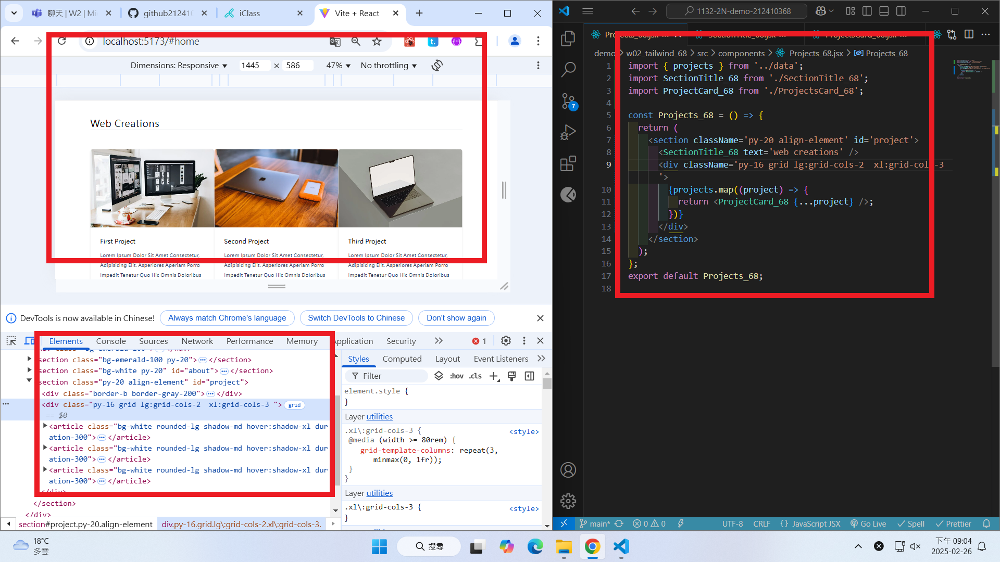

git config --global user.email "212410368@o365.tku.edu.tw"
git config --global user.name "ting"

W02-P1: Show <Hero_xx > with screen width = 768px


```
667489b htchung Wed Feb 26 19:24:18 2025 +0800  W02-P1: Show <Hero_xx > with screen width = 768px
```

W02-P2: Show <About_xx /> with <SectionTitle_xx />


```
ce0646e htchung Wed Feb 26 20:09:00 2025 +0800  W02-P2: Show <About_xx /> with <SectionTitle_xx />
```

W02-P3: Show <Projects_xx /> with responsiveness

#### => two projects in a row


#### => three projects in a row



```
355b947 htchung Wed Feb 26 20:59:04 2025 +0800  W02-P3: Show <Projects_xx /> with responsiveness
```
