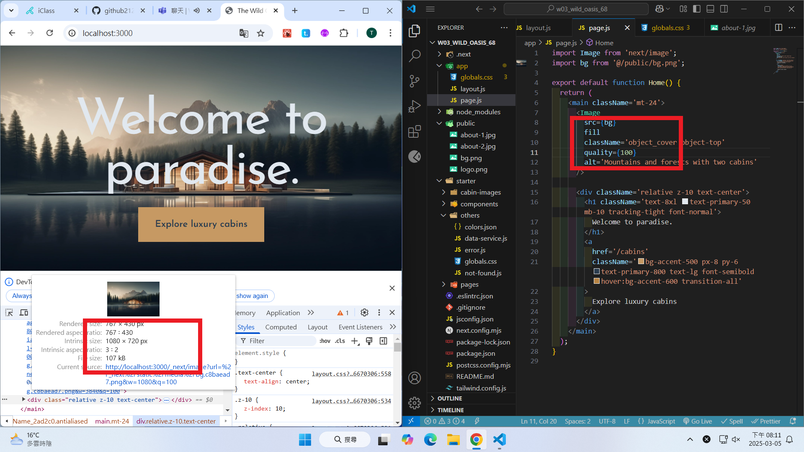
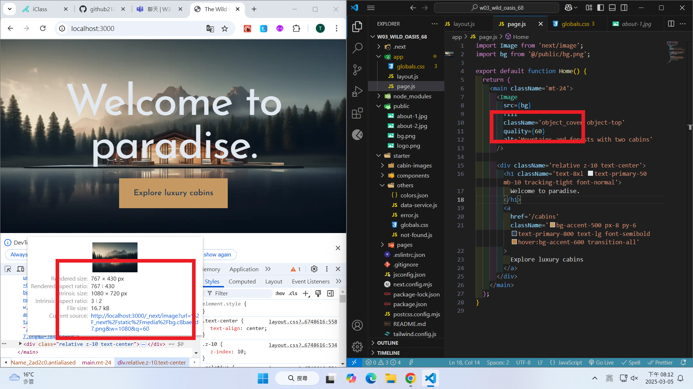
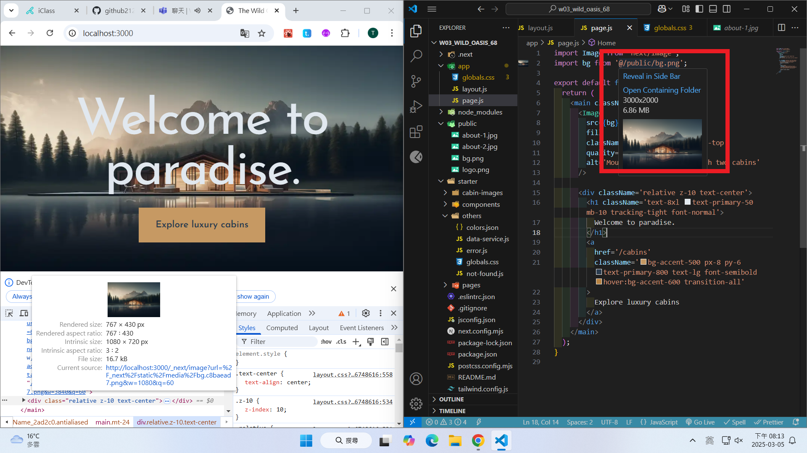

git config --global user.email "212410368@o365.tku.edu.tw"
git config --global user.name "ting"

W03-P1: Use Image quality to compare image size

#### => quality=100, image size = 107KB



#### => quality=60, , image size = 16.7KB



#### => original image size, size = 6.86 MB



```
0baf1ee htchung Wed Mar 5 19:55:32 2025 +0800   W03-P1: Use Image quality to compare image size
```
