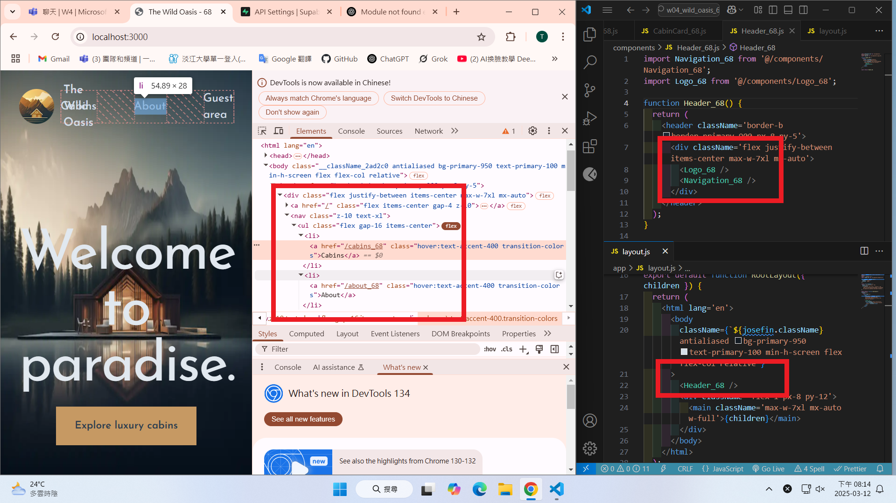
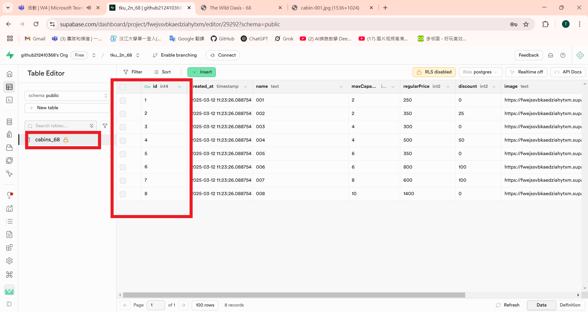
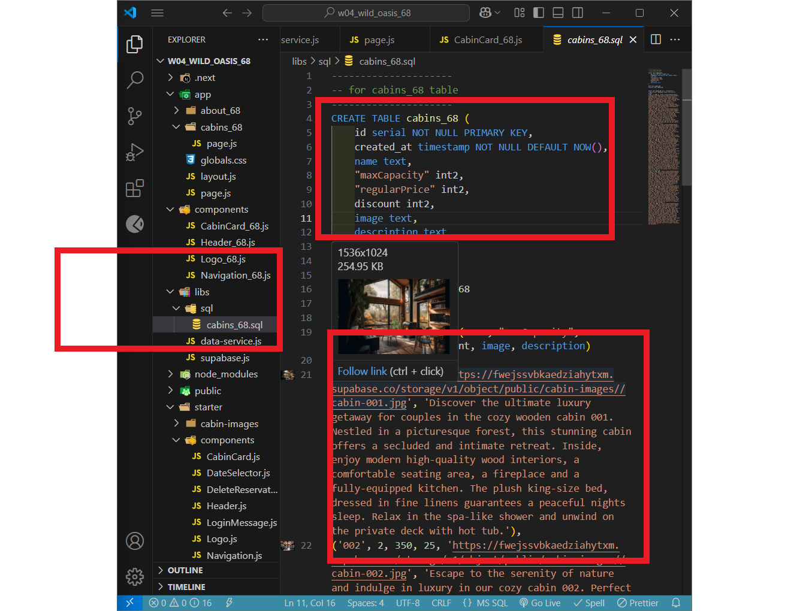
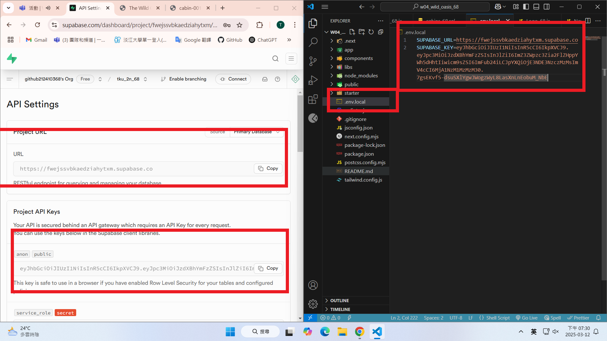
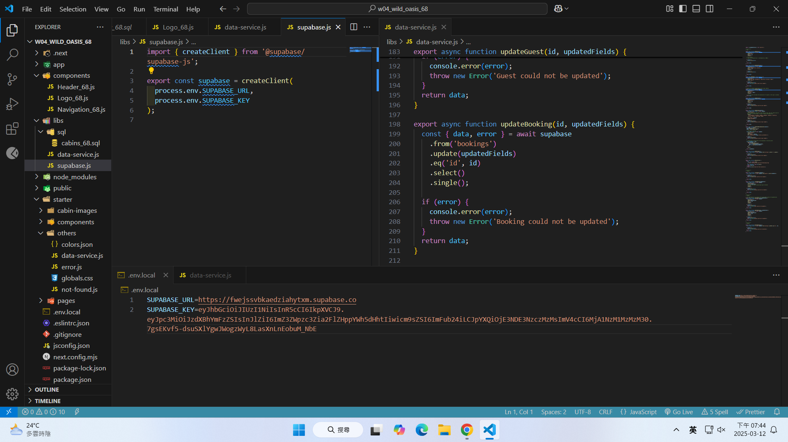
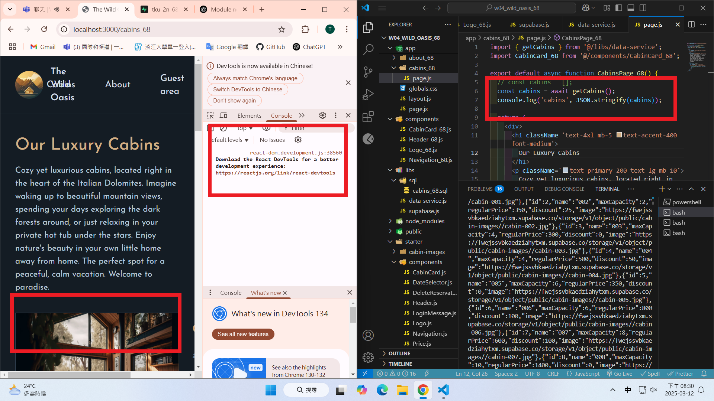
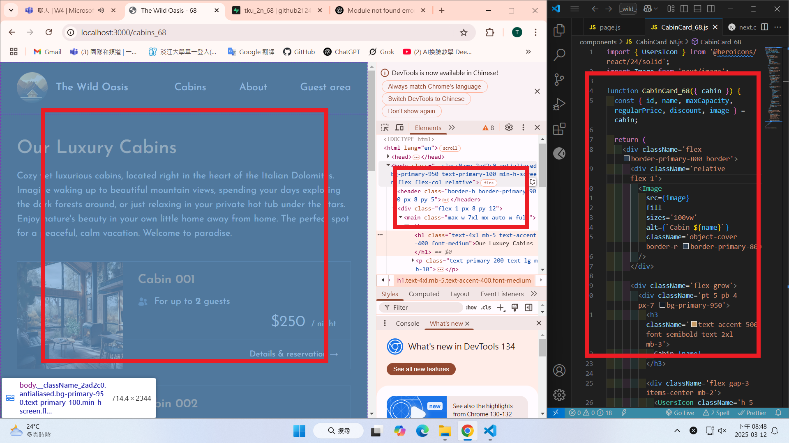
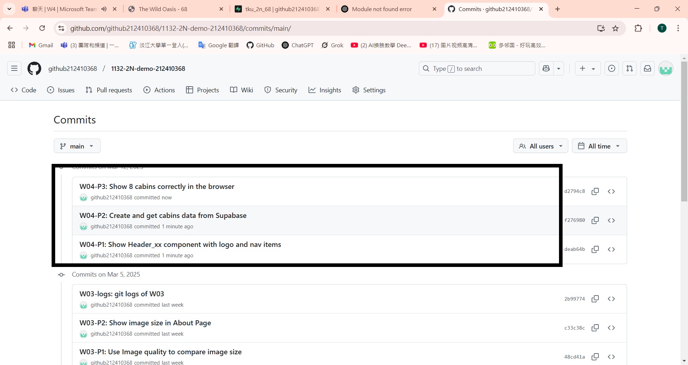

git config --global user.email "212410368@o365.tku.edu.tw"
git config --global user.name "ting"

W04-P1: Show Header_xx component with logo and nav items



```
c4b7770 htchung Wed Mar 12 19:00:46 2025 +0800   W04-P1: Show Header_xx component with logo and nav items
`
```

W04-P2: Create and get cabins data from Supabase

#### => setup cabins_xx table (8 data)



#### => sql command to create and insert data



#### => show how to get Supabase URL and key



### => show how to use Supabase client to get cabins data



### => show cabins data in server console



```
1e0b8ef htchung Wed Mar 12 20:03:33 2025 +0800  W04-P2: Create and get cabins data from Supabase
```

W04-P3: Show 8 cabins correctly in the browser


```
afa3bc4 htchung Wed Mar 12 20:50:34 2025 +0800  W04-P3: Show 8 cabins correctly in the browser
```

W04-P3: Show 8 cabins correctly in the browser



```
afa3bc4 htchung Wed Mar 12 20:50:34 2025 +0800  W04-P3: Show 8 cabins correctly in the browser
```

### W04-logs: git logs of W04


