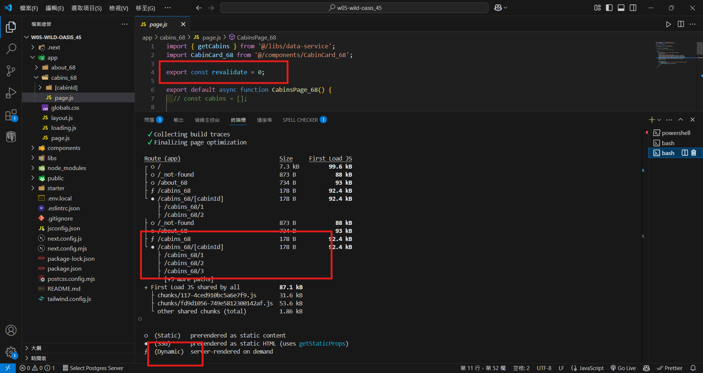

git config --global user.email "212410368@o365.tku.edu.tw"
git config --global user.name "ting"

W05-P1: use route /cabins_xx to show static rending and dynamic rendering
 
#### => Show route /cabins_xx as static route by using "npm run build" command
 

 
#### => change the price of cabin 1 in Supabase from 250 to 300, and refresh page, nothing change
 

 
#### => Show route /cabins_xx as dynamic route by using "npm run build" command
 

 
#### => change the price of cabin 1 in Supabase from 300 to 500, and refresh page, price does change
 

 
```
d0573c4 htchung Wed Mar 19 19:48:41 2025 +0800  W05-P1: use route /cabins_xx to show static rending and dynamic rendering
```


W05-P2: Implement route /cabins_xx/cabinId, and use SSG (Static Site Generation) approach
 
#### => Implement route /cabins_xx/cabinId using generateStaticParams()
 

 
#### => show route /cabins_xx/cabinId as SSG
 

 
#### => change route /cabins_xx/cabinId to dynamic route
 

 
#### => run route /cabins_xx/cabinId as SSG and change maxCapacity in Supabase, nothing happen
 

 
```
b74e6ee htchung Wed Mar 19 20:58:58 2025 +0800  W05-P2: Implement route /cabins_xx/cabinId, and use SSG (Static Site Generation) approach
```

 
### W05-logs: git logs of W05
 
