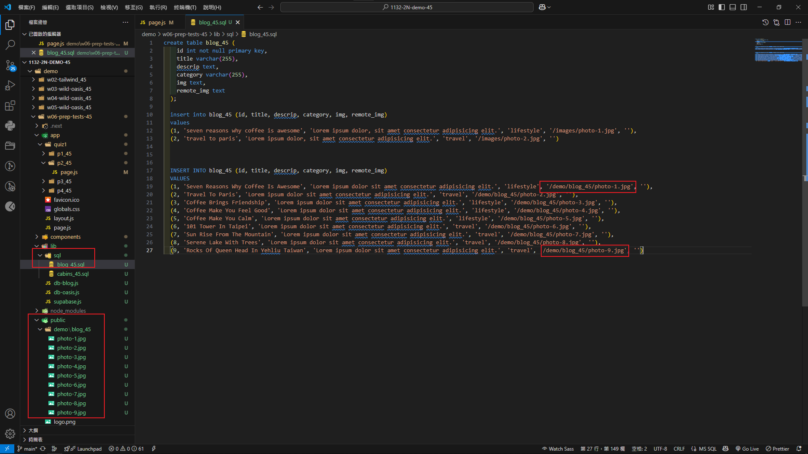

git config --global user.email "212410368@o365.tku.edu.tw"
git config --global user.name "ting"

### W06-P1: Show navigation for p1_xx, p2_xx, p3_xx, p4_xx


```

```

### W06-P2: Implement route /quiz1/p1_xx to show all cabins


```

```

### W06-P3: Implement route /quiz1/p2_xx to show static blogs

#### => show static blogs


#### => show blog_xx.sql with img pointing to /demo/blog_xx directory



```
a80ec1c Liucchien       Wed Mar 26 23:45:46 2025 +0800  show blog_xx.sql with img pointing to /demo/blog_xx directory
```

### W06-P4: Implement route /quiz1/p3_xx to show all blogs in Vercel


```

```

### W06-logs: git logs of W06


