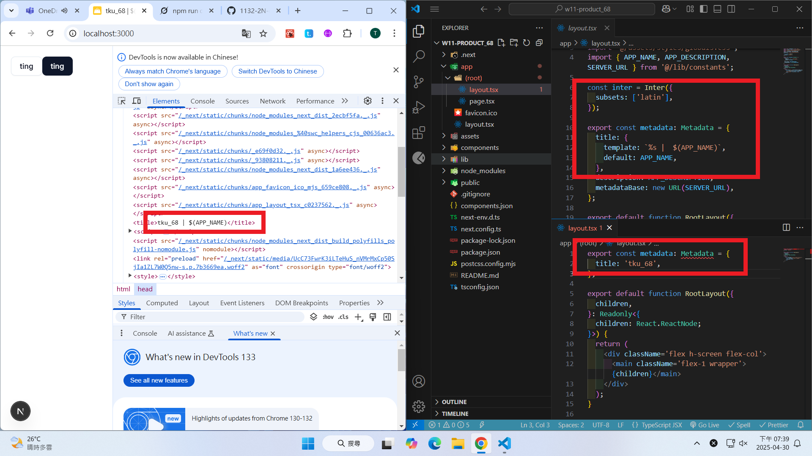
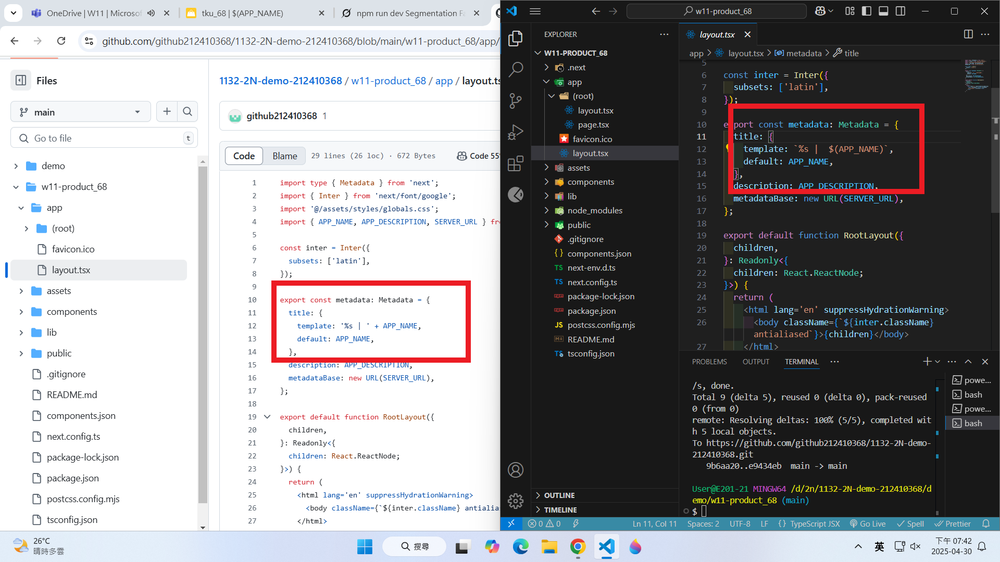
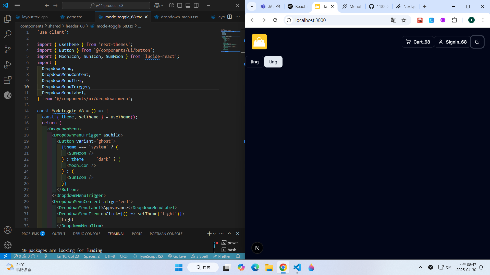
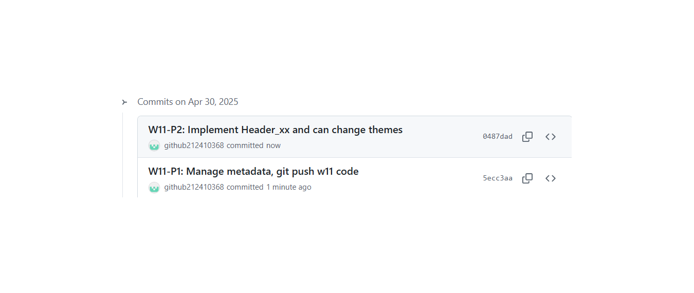

git config --global user.email "212410368@o365.tku.edu.tw"
git config --global user.name "ting"

W11-P1: Manage metadata, git push w11 code

#### => setup constants and metadata template



#### => git push demo/w11_prostore_xx code, and change repo name by adding your name



#### W11-P2: Implement Header_xx and can change themes



```
6360d59 htchung Wed Apr 30 20:50:40 2025 +0800  W11-P2: Implement Header_xx and can change themes
```

### W11-logs: git logs of W06


