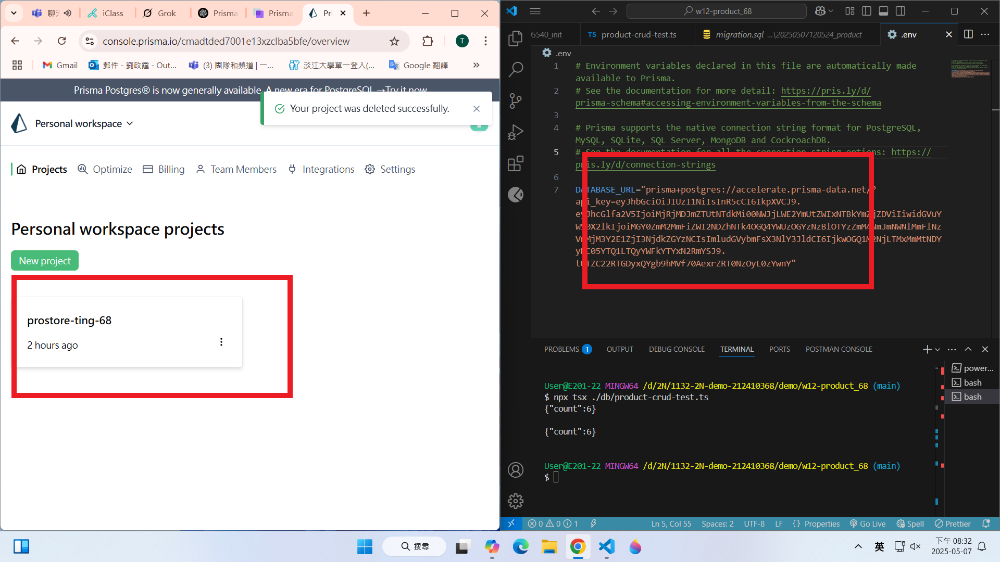
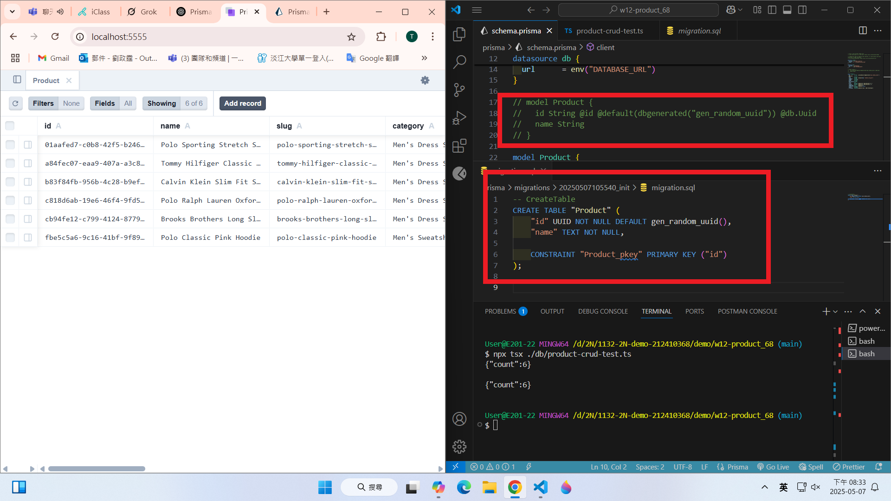
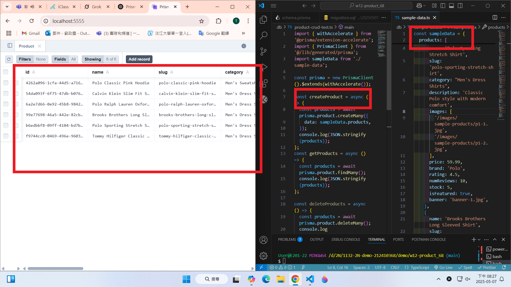
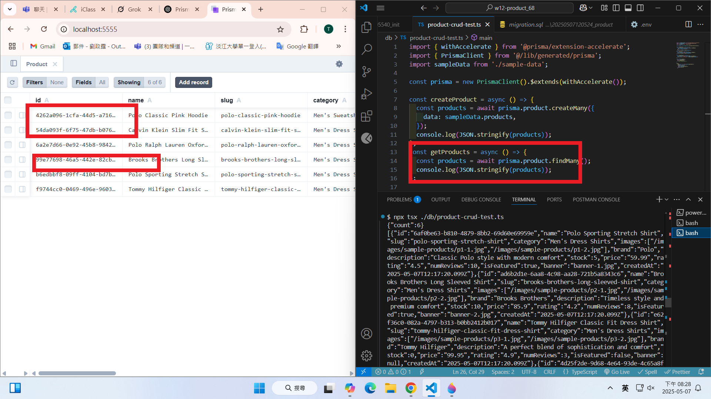
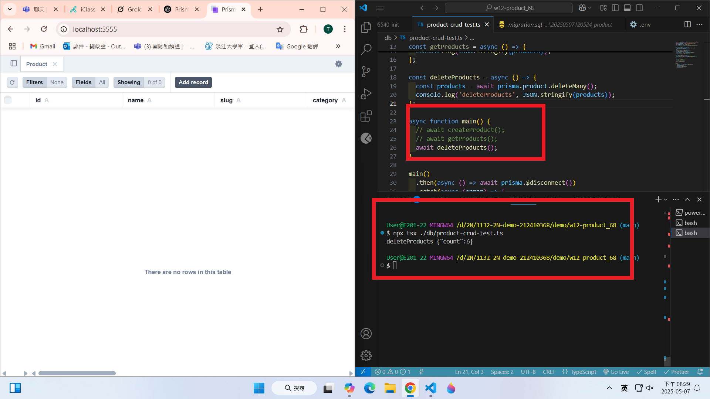
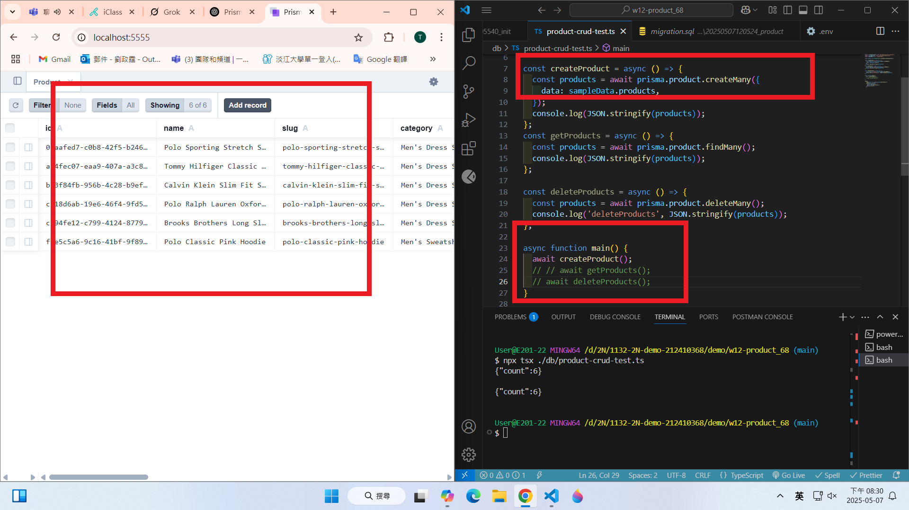
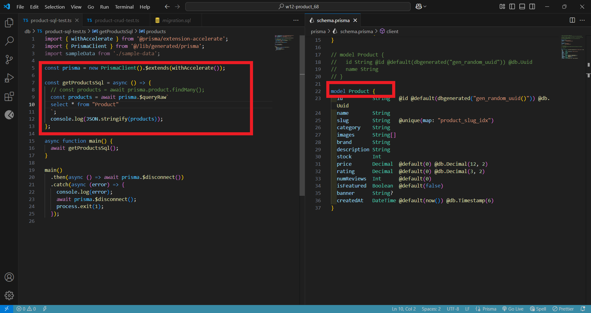
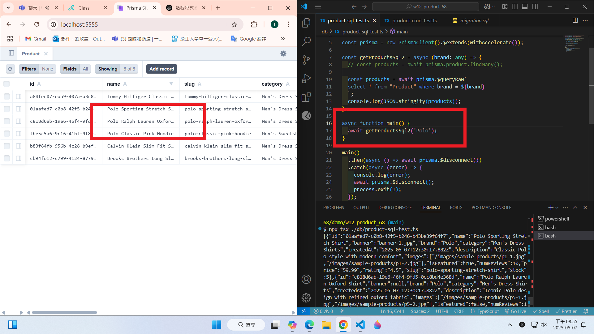
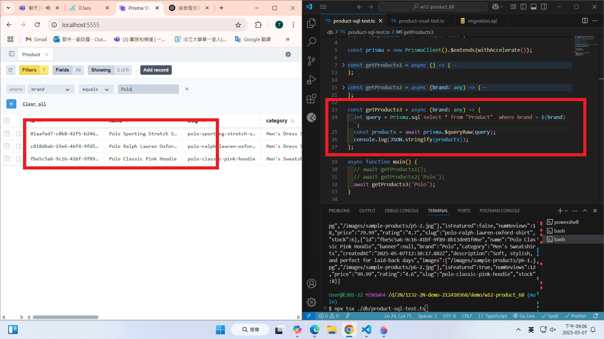

git config --global user.email "212410368@o365.tku.edu.tw"
git config --global user.name "ting"

W12-P1: Setup Prisma PostgreSQL with simple Product schema

#### => npx prisma init --db



#### => npx prisma migrate dev --name init



W12-P2: Do insert, get, delete operations on Product table

###### => create data from sample-data.ts



#### => get all products from Product table



##### => delete all products from Product table



#### => create data from sample-data.ts again



```
5114d60 htchung Wed May 7 20:22:38 2025 +0800   W12-P2: Do insert, get, delete operations on Product table
```

W12-P3: Use SQL to get products

#### => get all products



#### => get products with brand 'Polo'



#### => show how to use $queryRaw(query)



```
cb59c90 htchung Wed May 7 21:03:14 2025 +0800   W12-P3: Use SQL to get products
```
