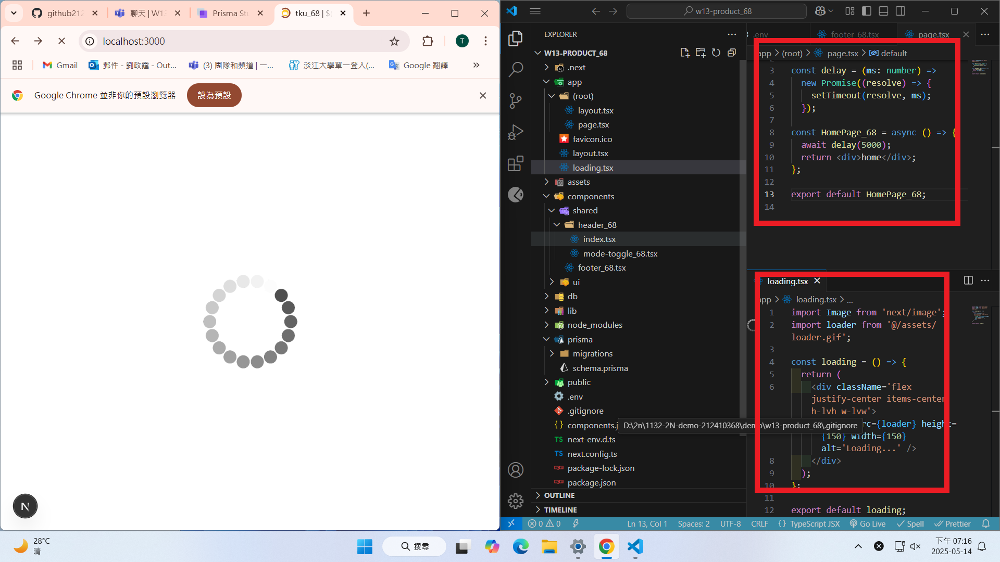
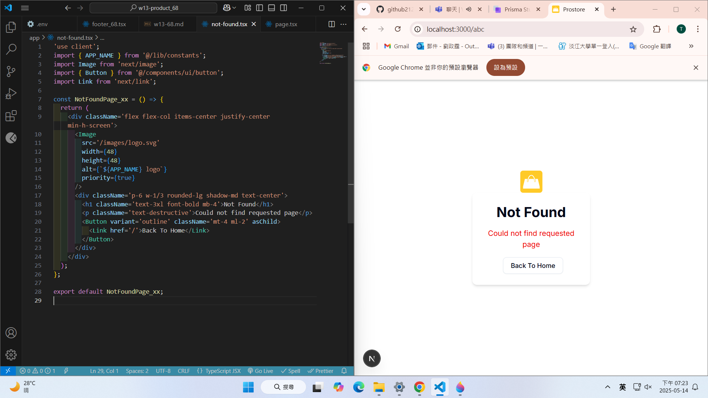
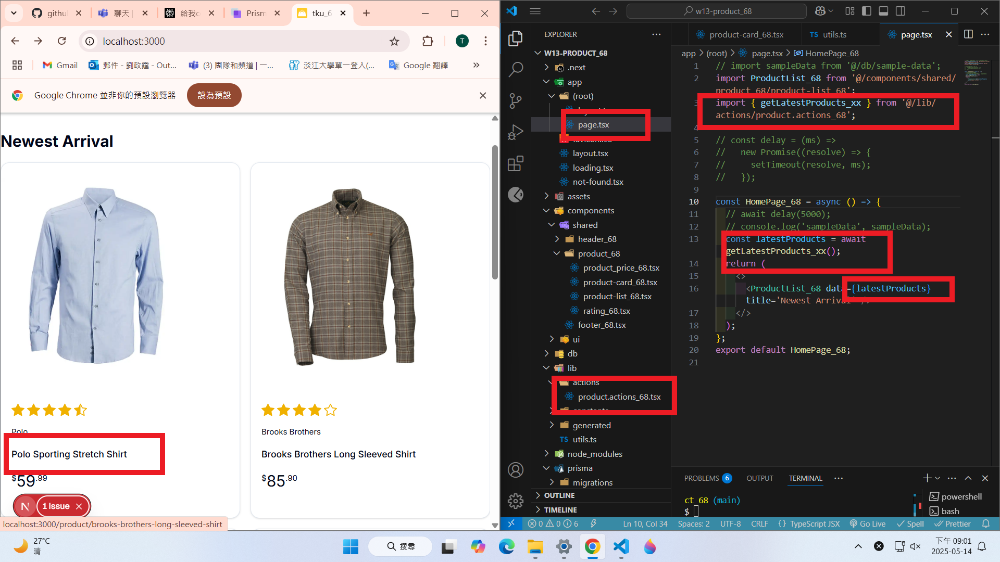
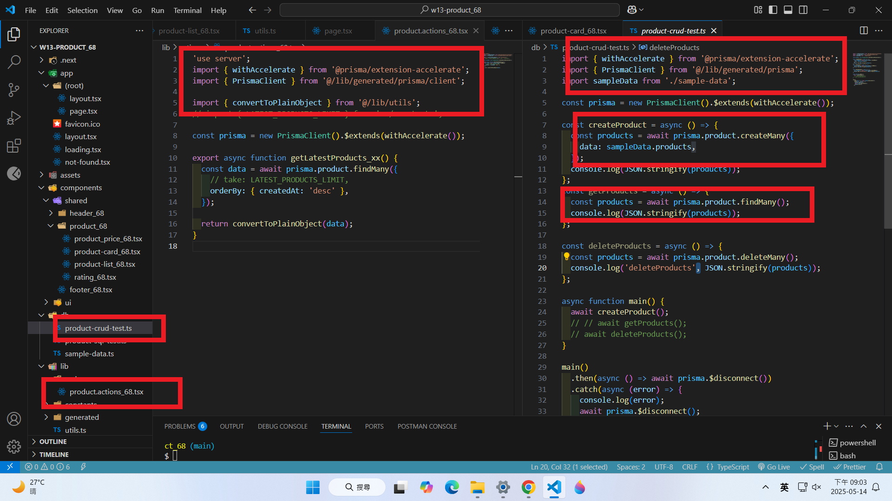

git config --global user.email "212410368@o365.tku.edu.tw"
git config --global user.name "ting"

W13-P1: Create global loading page



```
e6f8519 htchung Wed May 14 19:15:46 2025 +0800  W13-P1: Create global loading page
```

W13-P2: Create global not-found page



```
9add206 htchung Wed May 14 19:24:38 2025 +0800  W13-P2: Create global not-found page
```

W13-P3: Get Latest Product in Home Page

#### => get latest products from Database



#### => product.actions_xx.ts code is mainly from product-crud_xx.tsx



```
7cc990 htchung Wed May 14 20:59:39 2025 +0800  W13-P3: Get Latest Product in Home Page
```
