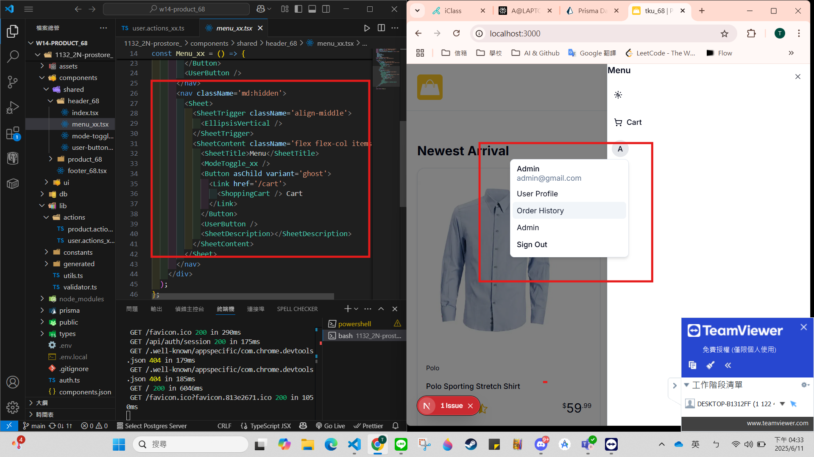
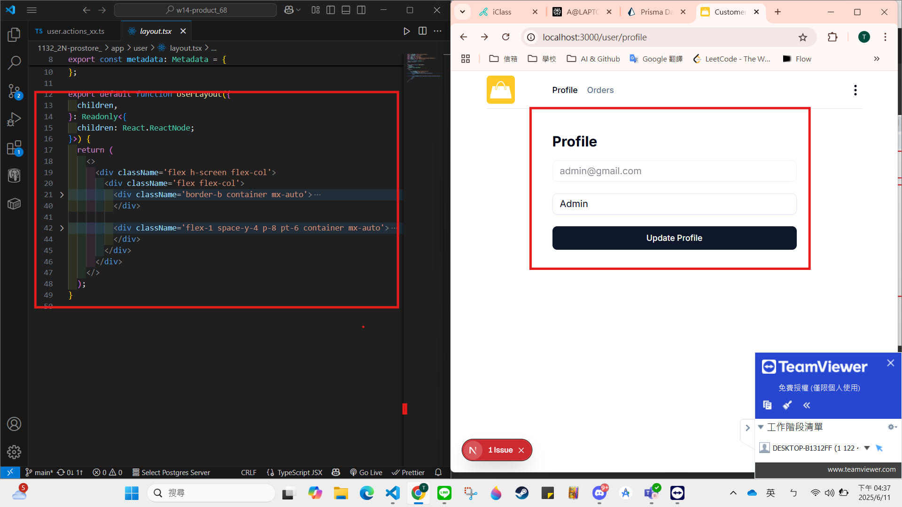

git config --global user.email "212410368@o365.tku.edu.tw"
git config --global user.name "ting"


W15-P1: Make sign-in and sign-up work
 
#### => sign-in, check session user
 

 
#### => sign-in related code
 

 
#### => sign-up, check session user
 

 
#### => sign-up related code
 

 
```
bfc44b3 htchung Wed May 28 19:30:19 2025 +0800  W15-P1: Make sign-in and sign-up work

W15-P2: Menu and UserButton
 
#### => how sheet is displayed in responsive mode
 

 
#### => UserButton with items associated with it
 

 
```
d844212 htchung Wed May 28 20:00:12 2025 +0800  W15-P2: Menu and UserButton
```

W15-P3: Show how to show /user/profile
 
#### => show layout with 2 parts, nav and profile info
 

 
#### => show how header is composed with 3 parts
 

 
```
7bf9c73 htchung Wed May 28 20:44:41 2025 +0800  W15-P3: Show how to show /user/profile
```
 